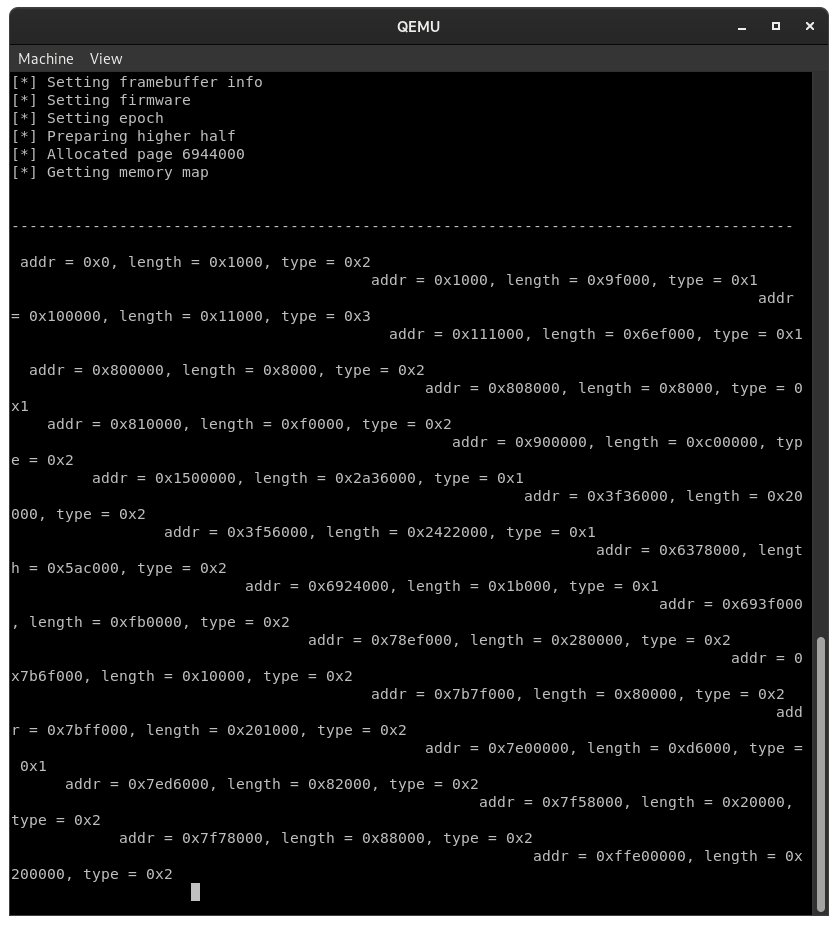

# The tOS Operating System

t Operating System is an independant OS written in C


## Information
### Description
tOS is a hobby operating system with a monlithic kernel that I want to be extremely modular and portable accross different architectures. The main platform for tOS is amd64 with UEFI firmware so it is possible to run it on any modern PC.


### Supported Platfroms
 * x86-64(amd64) with UEFI boot environment


### Documentation
* [Full tOS Documentation(may be incomplete)](notes/documentation.md)
* [Coding Style](notes/coding_style.md)
* [tOS Roadmap](notes/plan.md)
* [Resources(Links, Documents and Books) collected while working on tOS](notes/resources.md)
* Notes collected while making the OS(techinal, algorithms) are collected in notes/info folder


### Screenshots



## Building TOS
_NOTE: These are the instructions that were only tested on Debian based systems(e.g. Debian, Ubuntu) and RHEL based systems(e.g. Fedora)_

### Setup
Get ready for the build by getting source code and going to the directory with code

```
git clone https://github.com/tos
cd tos/src/
```


### Toolchain
First the toolchain should be made to compile the operating system. The toolchain compilation script gives a lot of options, but in most cases only the things that are outputed by default(without going into configuration) are needed.

```
make toolchain
```
Answers to questions(Works for most cases)

`Package Manager(dnf, apt, macos, other):` - `Yours package manager`

`Do you want to compile the EDK2 tools(y/n):` - `y`

`Do you want to configure other options(y/n):` - `n`


### Build and Run
There are multiple options on how the tOS could be built and they are described in the documentation, default ones are:

_Note: These options are already fully packed with all steps of building and will automatically run the OS in qemu after the build_

Compile defualt configuration(x86-64, UEFI firmware)
```
make
```

To change make configuration, read the build system section in [documentation](notes/documentation.md#build-system)


## Credits
* TomatBoot Bootloader
	* [Original Source](https://github.com/TomatOrg/TomatBoot)